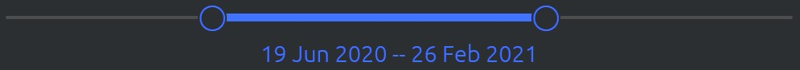
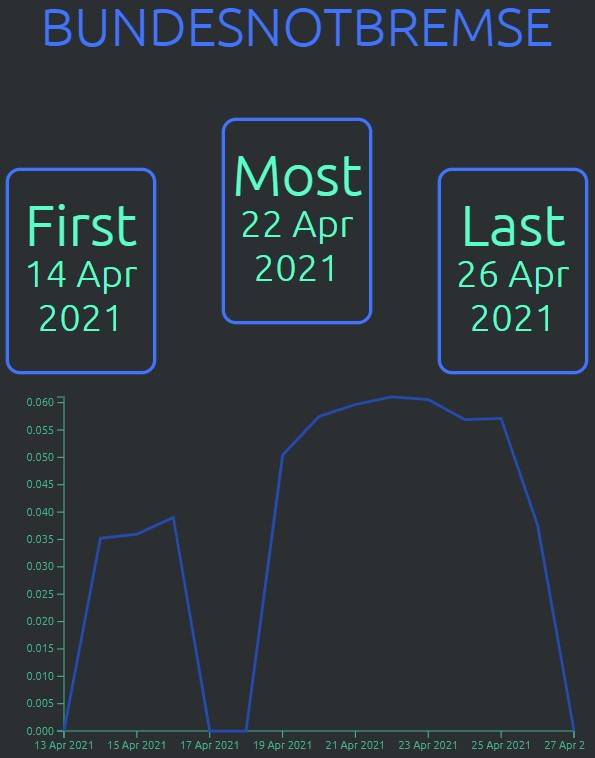
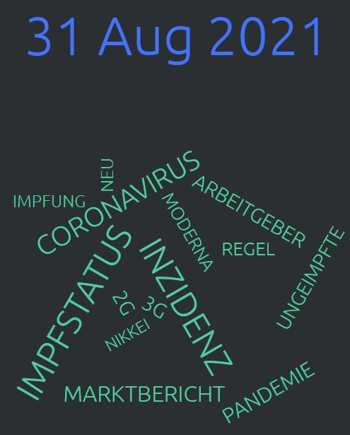
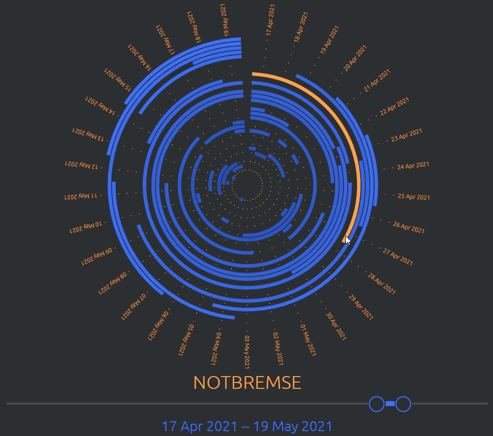

# Word Frequency Visualization
This is the project for my bachelor thesis.

The finished Project can be viewed [here](https://www.corona.j-l-m.eu). The website was build and tested using Google Chrome.For my example visualization I am using Twitter Data of German news agencies. All Tweets will be filtered by corona keywords.

In general the whole project can be used with your own dataset. Alternatively Twitter data can be used with other key- and stopwords. Even though my example is using german Tweets, the code supports 20+ Languages.

## Screenshots of the finished website

The main graph:

Date Range slider:

Detail view of a specific word and date:

Gif showing hover animations:

## Quick explanation of the process
In general all Textdata is tagged with a timestamp. Im using TF-IDF the calculate word relevance by day. We then smooth relevance by weeks. The final visualization shows radial stacked timelines for the different words. The User is able to select a date range and interact with the graph by clicking on words or dates.
